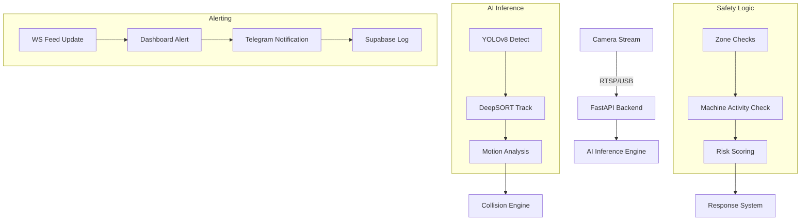

# 🏗️ CraneGuard AI: Industrial Safety Overview

**CraneGuard AI** is a state-of-the-art vision-based safety system designed to eliminate industrial accidents by monitoring high-risk environments in real-time. It uses advanced AI to bridge the gap between human presence and heavy machinery operation.

---

## 🚀 What is CraneGuard AI?

The system acts as a digital safety officer, monitoring live camera feeds to identify workers, cranes, and forklifts. It goes beyond simple detection by analyzing **spatial relationships** and **contextual activity** to prevent potential collisions before they happen.

### Core Capabilities:
- **Real-time Detection & Tracking**: Persistent tracking of individuals and vehicles across the site.
- **Intelligent Safety Zones**: Virtual barriers (polygons) that detect violations based on machine activity.
- **Dynamic Risk Assessment**: Real-time safety scores and spatial heatmaps of high-incident areas.
- **Multi-Channel Alerting**: Instant notifications via a Command Center dashboard and automated Telegram alerts.

---

## 🛠️ Technical DNA (Tech Stack)

CraneGuard AI is built on a high-performance, full-stack architecture that ensures low latency and mission-critical reliability.

### 🧠 Backend (The Brain)
- **FastAPI**: Asynchronous Python framework for the core API and WebSocket streaming.
- **YOLOv8 (Ultralytics)**: Advanced deep learning model for real-time object detection (Persons, Cranes, Forklifts).
- **DeepSORT**: Multi-object tracking algorithm that maintains consistent IDs even under occlusion.
- **OpenCV**: Core vision library for frame processing and zone geometry logic.

### 🎨 Frontend (The Command Center)
- **React + Vite**: Ultra-fast frontend development and execution.
- **TailwindCSS**: Modern, utility-first styling for a premium UI.
- **Framer Motion**: Smooth micro-animations and transitions for an intuitive user experience.
- **Recharts**: Dynamic visualization of safety metrics and historical trends.

### ☁️ Infrastructure & Mobile
- **Supabase (PostgreSQL)**: Scalable database for incident logging and site configuration.
- **Supabase Storage**: Secure cloud storage for incident snapshots.
- **Telegram Bot API**: Instant external notification delivery.
- **Capacitor**: Cross-platform wrapper for Android/iOS mobile deployment.

---

## ⚙️ How It Works (The Lifecycle)

### The 4-Step Process:
1.  **Vision Intake**: The system captures frames from industrial IP cameras at high frequency.
2.  **Cognitive Analysis**: YOLOv8 locates objects, while DeepSORT remembers who is who. The system analyzes "micro-shaking" to determine if a machine is active.
3.  **Spatial Auditing**: The system checks if any person is within a "Danger Zone" while a machine is operating.
4.  **Instant Response**: If a violation is found, the UI flashes red, a siren is triggered locally (optional), and a snapshot is sent to the safety supervisor's Telegram in milliseconds.

---

## 📊 Business Value
- **Zero Accident Goal**: Proactive prevention rather than reactive reporting.
- **Compliance Ready**: Digital logs provide an audit trail for safety standards (OSHA, etc.).
- **Cost Reduction**: Lower insurance premiums and reduced downtime from accidents.
- **Worker Peace of Mind**: A secondary safety layer for personnel in high-stress environments.
