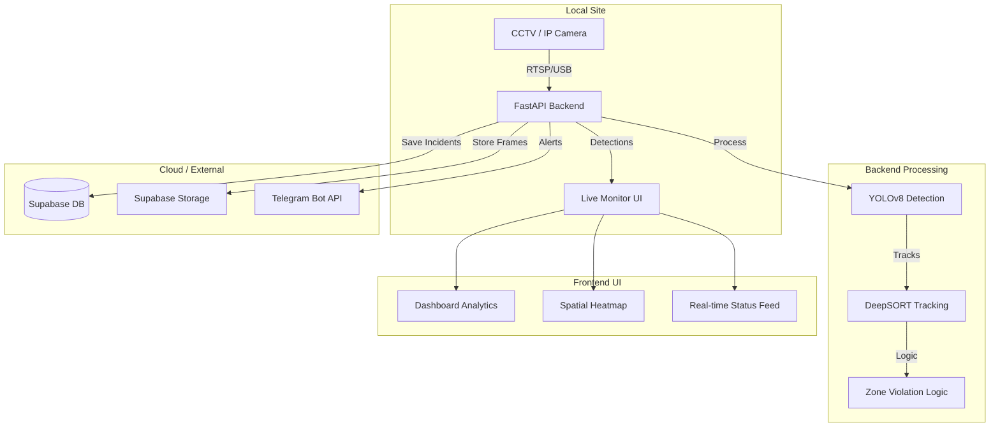

# CraneGuard AI: Detailed Project Documentation

## 1. Project Overview
CraneGuard AI (also referred to as CraneAI) is a state-of-the-art safety monitoring system designed for industrial and construction environments. It leverages computer vision and real-time data processing to prevent accidents involving cranes, forklifts, and personnel in high-risk zones.

### Core Objectives:
*   **Prevent Collisions**: Detect people and machinery in real-time.
*   **Enforce Safety Zones**: Monitor virtual "Danger" and "Warning" zones.
*   **Automate Alerts**: Instant notifications via Telegram and local sirens.
*   **Data-Driven Insights**: Provide analytics on safety violations and high-risk patterns.

---

## 2. System Architecture

### 2.1 Technology Stack
*   **Backend**: Python, FastAPI, YOLOv8 (Ultralytics), DeepSORT, OpenCV.
*   **Frontend**: React (Vite), TailwindCSS, Framer Motion, Recharts.
*   **Database**: Supabase (PostgreSQL).
*   **Storage**: Supabase Storage (for incident snapshots).
*   **Notifications**: Telegram Bot API.

---

## 3. Key Components & Logic

### 3.1 Safety Zone Logic (`zone_logic.py`)
Safety zones are defined as polygons. The system classifies detections into:
*   **Green**: No people in zone.
*   **Yellow (Warning)**: Person detected in zone, but machine is idle.
*   **Red (Danger)**: Person detected in zone AND machine is active (or person is touching machine).

#### Automatic Machine Detection:
Instead of manual toggles, the system uses AI to detect machine activity:
1.  **Direct Detection**: If a crane/forklift is detected in the zone.
2.  **Movement Detection**: If pixel motion/shaking is detected within the zone boundary.

### 3.2 Alert Engine (`alert_engine.py`)
The alert engine handles:
*   **Cooldown Management**: Prevents spamming alerts (30s cooldown per zone).
*   **Snapshot Capture**: Saves the frame where the violation occurred.
*   **Telegram Integration**: Sends descriptive messages with the violation snapshot.
*   **Supabase Sync**: Logs incidents for historical analysis.

### 3.3 Analytics & Heatmap
*   **Safety Score**: Dynamically calculated based on violation frequency.
*   **Spatial Heatmap**: Visualizes the density of violations across the monitored area using historical data points.

---

## 4. API Reference (FastAPI)

| Endpoint | Method | Description |
| :--- | :--- | :--- |
| `/ws/feed` | WebSocket | Main stream for video, detections, and real-time alerts. |
| `/incidents` | GET | List historical incidents from Supabase. |
| `/stats` | GET | Aggregate metrics (safety score, today's violations). |
| `/zones` | GET/POST | Fetch or update safety zone configurations. |
| `/machine/state`| GET/POST | Manual override for machine active status. |

---

## 5. Security & Persistence (Supabase)

The system requires two tables in your Supabase project:

### `incidents` Table
| Column | Type |
| :--- | :--- |
| `id` | uuid (PK) |
| `zone_id` | text |
| `zone_name` | text |
| `type` | text |
| `severity` | text |
| `timestamp` | timestamptz |
| `acknowledged` | boolean |
| `frame_url` | text (URL to Storage) |

### `zones` Table
| Column | Type |
| :--- | :--- |
| `id` | text (PK) |
| `name` | text |
| `polygon` | jsonb (Array of [x,y]) |
| `active` | boolean |

---

## 6. Troubleshooting

### 6.1 Camera Connection Issues
*   **Symptom**: "CRITICAL: Could not open any camera source."
*   **Fix**: Ensure no other app (like Zoom/Teams) is using the camera. On Windows, the system tries `CAP_DSHOW` and `CAP_MSMF` backends automatically. You can explicitly set `CAMERA_SOURCE=1` or a video file path in `.env`.

### 6.2 WebSocket Disconnections
*   **Symptom**: Video feed freezes or shows "Disconnected".
*   **Fix**: Check if the backend is running (`uvicorn main:app`). Ensure the `VITE_API_URL` in the frontend matches your backend address.

### 6.3 Missing Detections
*   **Cause**: Lighting conditions or camera angle.
*   **Fix**: Adjust YOLOv8 confidence thresholds in `detector.py`. Currently, it uses `yolov8n.pt` for speed; for higher accuracy, switch to `yolov8s.pt`.

---

## 7. Future Roadmap
*   **Facial Recognition**: Identify specific workers (authorized/unauthorized).
*   **Multi-Camera Support**: Unified dashboard for multiple factory aisles.
*   **Voice Alerts**: Local audio warnings via connected speakers.
*   **Predictive Analytics**: Forecasting high-risk times of day based on historical trends.
